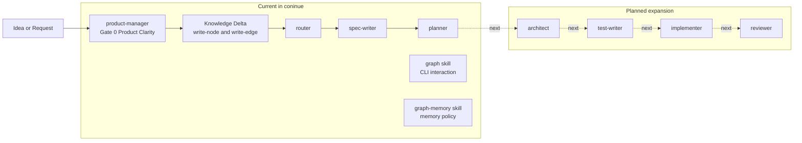

# Coninue Pack

Bootstrap pack with the first stable Continue elements.

## Included Now

### Agents
- `product-manager`
- `router`
- `spec-writer`
- `planner`

### Skills
- `graph`
- `graph-memory`

### Workflow Coverage
- Stage 0 Product Clarity Gate via `product-manager`
- Shared lifecycle contract: Init -> Execute -> Post

## Purpose

Use this pack when you want to start enterprise-grade delivery with a strict discovery-first entry point before technical implementation agents are added.

## Incremental Expansion Plan

Planned next additions to this pack:
- `architect`
- `test-writer`
- `implementer`
- `reviewer`

## Mermaid Overview

## Exit Criteria for This Pack Stage

- Idea is converted into a clear product brief.
- Scope, success metrics, and NFRs are explicit.
- Durable knowledge is persisted with provenance.
- Handoff for technical workflow start is available.
